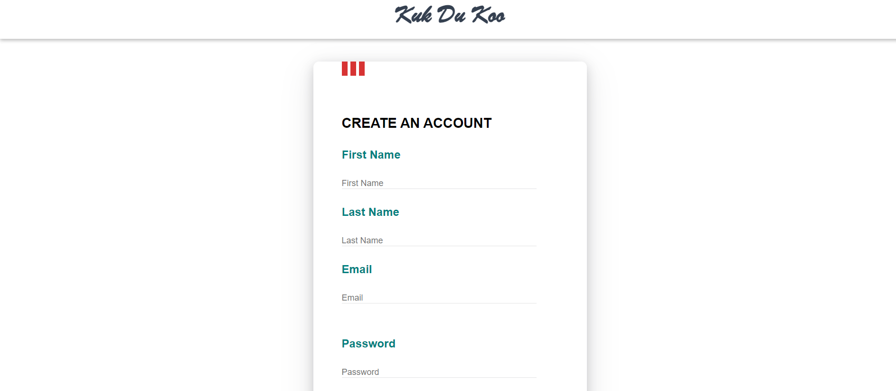

# KFC Clone

This is a clone of the Kentucky Fried Chicken (KFC) restaurant chain, a fast-food franchise that specializes in fried chicken and other food items. This clone is intended for educational purposes only and is not affiliated with the original KFC brand.

## Renamed as :

# KUKDUKOO

## Website Logo :

# KFC Clone
This is a clone of the KFC website, created during the Construct Week at Masai.
## Technologies Used
- HTML
- CSS
- JavaScript

## Features
- User signup and login page with validation
- Users can add products to their cart and can manage product quantity.
- Users can remove products from the cart.
- Users can filter the products according to their price.
- Responsive design for desktop and mobile devices

## Demo
You can see a live demo of this KFC clone at [https://kfc-clone-kukdukoo.netlify.app/].
## Installation
To install and run this project on your local machine, follow these steps:
1. Clone the repository using `git clone [REPO URL]`
2. Open the project directory in a code editor

## Contributing
If you have any feedback or suggestions for how to improve this KFC clone, feel free to create a pull request or open an issue.

# Screenshots

## Landing Page

## MENU PAGE

## PRODUCT PAGE

## SIGNUP PAGE

## LOGIN PAGE

## CART PAGE

## PAYMENT PAGE

## THANKYOU PAGE

